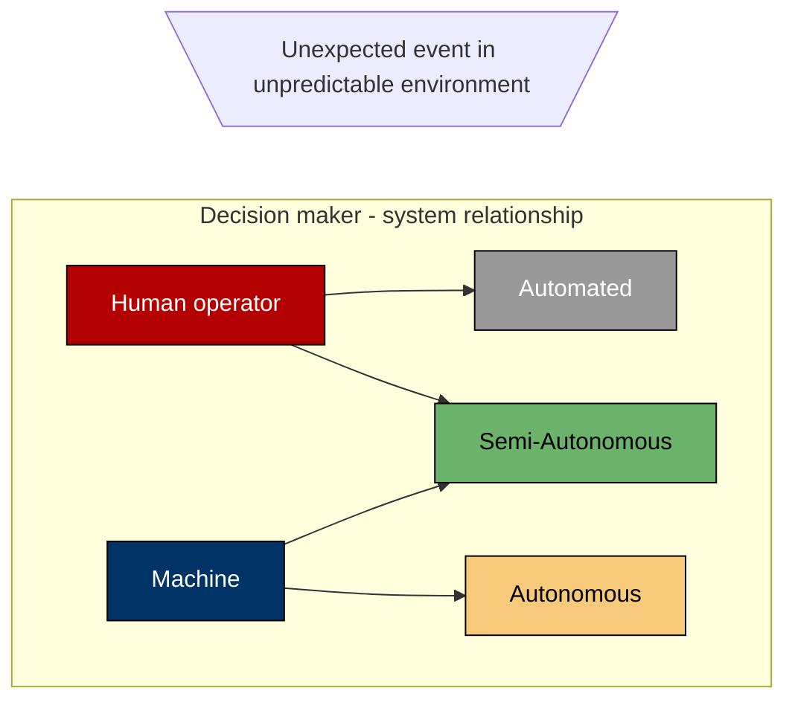

Blah blah blah...

# h1

Blah blah blah...

## h2

Blah blah blah...

### h3

Blah blah blah...

#### h4

Blah blah blah...

##### h5

Blah blah blah...

###### h6

Blah blah blah Blah blah blah...

> normal quote

- 1
- 2
- 3

1. a
2. b
3. c

> [!cite] Citation!?
> Whaaat?!

blah blah BlaH...

