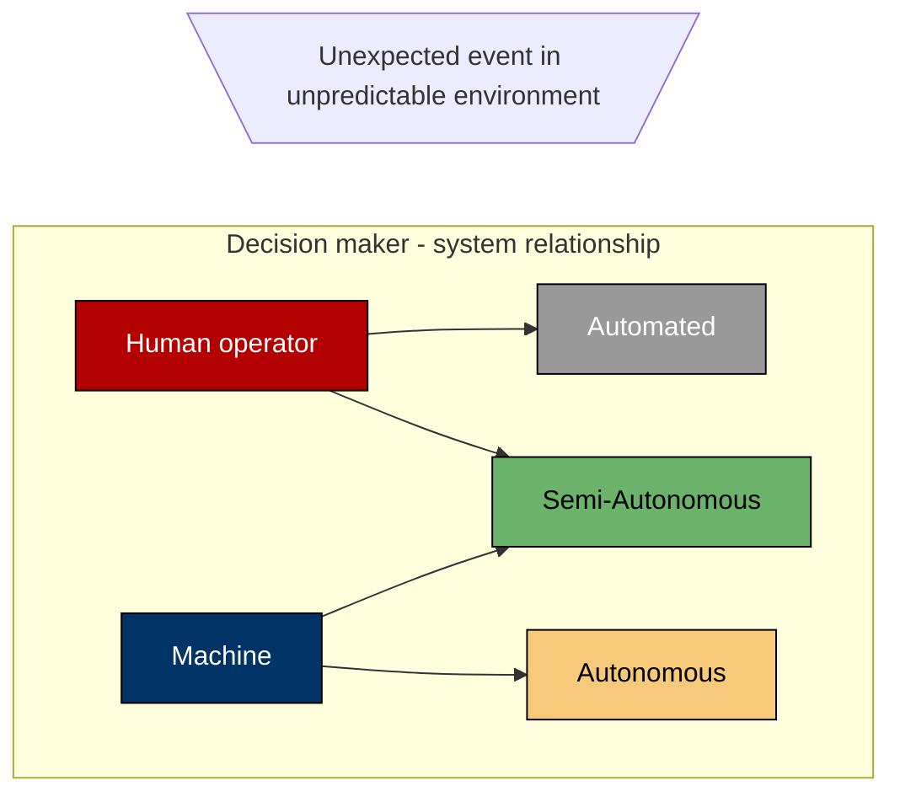

TODO...

Blah...

# Heading #1

Blah blah...

## Heading #2

Blah blah ...

### Heading 3

Blah blah blah...

#### Heading 4

Blah blah blah blah...

##### Heading 5

Blah blah blah blah blah...

###### Heading 6

Blah blah blah Blah blah blah...

A surprise mermaid diagram!!

Callout time!

> [!cite] Citation!?
> Whaaat?!

Listing letters and numbers in lists:

- 1
- 2
- 3

1. a
2. b
3. c

I love quotes:

> normal quote
