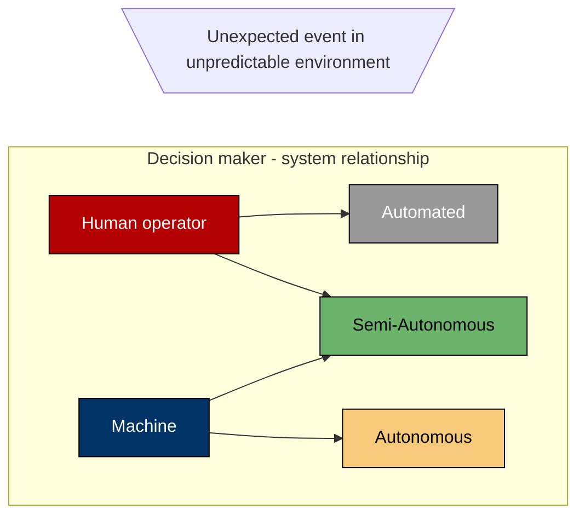

# Welcome to Trellis

A garden for your mind? Don't mind if I do...

- ### [Setup Guide](./setup-guide)
- ### [Publishing to the World Wide Web](./hosting)
- ### [Roadmap and Changelog](./roadmap-and-changelog)

# Heading #1

Blah blah...

## Heading #2

Blah blah ...

### Heading 3

Blah blah blah...

#### Heading 4

Blah blah blah blah...

##### Heading 5

Blah blah blah blah blah...

###### Heading 6

Blah blah blah Blah blah blah...

A mermaid diagram!!



Callouts can be used to improve scannability and retention without diluting your content.

> [!cite] `> [!cite] Trellis` Admonition/Callout
> the sunbathed wooden supports grew many plants

<br/>

> [!NOTE]- Callouts can be collapsed: `> [!note]- Callout title`
> This compiles on stable Rust.
> The optimizer will still outsmart you.

<br/>

> [!TIP]
> If this lifetime annotation looks unnecessary,
> congratulations—you are about to delete it and break everything.

<br/>

> [!WARNING]
> This function is `unsafe`.
> The compiler has left the chat.

<br/>

> [!IMPORTANT]
> This API is stable.
> Your assumptions about it are not.

<br/>

> [!CAUTION]
> Removing this `Arc` will improve performance
> right up until your program becomes a distributed bug generator.
>
> ```js
> // Yes, this clone is intentional.
> // No, you cannot “optimize” it away.
> let value = value.clone();
> ```

> [!note] Callout / `> [!note]` / Admonition
> a distributed bug generator.

<br/>

> [!abstract] Callout / `> [!abstract]` / Admonition
> a distributed bug generator.

<br/>

> [!summary] Callout / `> [!summary]` / Admonition
> a distributed bug generator.

<br/>

> [!tldr] Callout / `> [!tldr]` / Admonition
> a distributed bug generator.

<br/>

> [!info] Callout / `> [!info]` / Admonition
> a distributed bug generator.

<br/>

> [!todo] Callout / `> [!todo]` / Admonition
> a distributed bug generator.

<br/>

> [!tip] Callout / `> [!tip]` / Admonition
> a distributed bug generator.

<br/>

> [!hint] Callout / `> [!hint]` / Admonition
> a distributed bug generator.

<br/>

> [!important] Callout / `> [!important]` / Admonition
> a distributed bug generator.

<br/>

> [!success] Callout / `> [!success]` / Admonition
> a distributed bug generator.

<br/>

> [!check] Callout / `> [!check]` / Admonition
> a distributed bug generator.

<br/>

> [!done] Callout / `> [!done]` / Admonition
> a distributed bug generator.

<br/>

> [!question] Callout / `> [!question]` / Admonition
> a distributed bug generator.

<br/>

> [!help] Callout / `> [!help]` / Admonition
> a distributed bug generator.

<br/>

> [!faq] Callout / `> [!faq]` / Admonition
> a distributed bug generator.

<br/>

> [!warning] Callout / `> [!warning]` / Admonition
> a distributed bug generator.

<br/>

> [!attention] Callout / `> [!attention]` / Admonition
> a distributed bug generator.

<br/>

> [!caution] Callout / `> [!caution]` / Admonition
> a distributed bug generator.

<br/>

> [!failure] Callout / `> [!failure]` / Admonition
> a distributed bug generator.

<br/>

> [!missing] Callout / `> [!missing]` / Admonition
> a distributed bug generator.

<br/>

> [!fail] Callout / `> [!fail]` / Admonition
> a distributed bug generator.

<br/>

> [!danger] Callout / `> [!danger]` / Admonition
> a distributed bug generator.

<br/>

> [!error] Callout / `> [!error]` / Admonition
> a distributed bug generator.

<br/>

> [!bug] Callout / `> [!bug]` / Admonition
> a distributed bug generator.

<br/>

> [!example] Callout / `> [!example]` / Admonition
> a distributed bug generator.

<br/>

> [!quote] Callout / `> [!quote]` / Admonition
> a distributed bug generator.

<br/>

> [!cite] Callout / `> [!cite]` / Admonition
> a distributed bug generator.

---

Listing letters and numbers in lists:

- 1
- 2
- 3

1. a
2. b
3. c

I love quotes:

> normal quote
